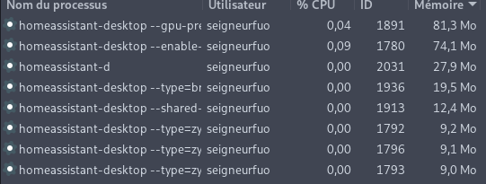

# 

## Exemple homeassistant-desktop VS home-assistant-desktop-applet

### Que fait homeassistant-desktop ?


### Empreinte mémoire



```81.3 + 74.1 + 27.9 + 19.5 + 12.4 + 9.2 + 9.1 + 9.0 = 242.5Mo...```


``` Python + PyQt6 = 34.5Mo```

```Différence: 242.5 - 34.5 = 208Mo```